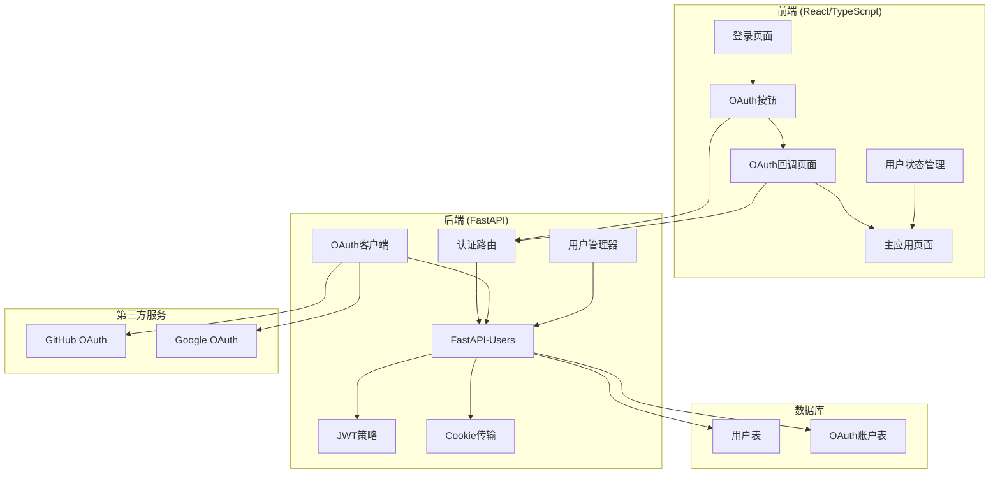
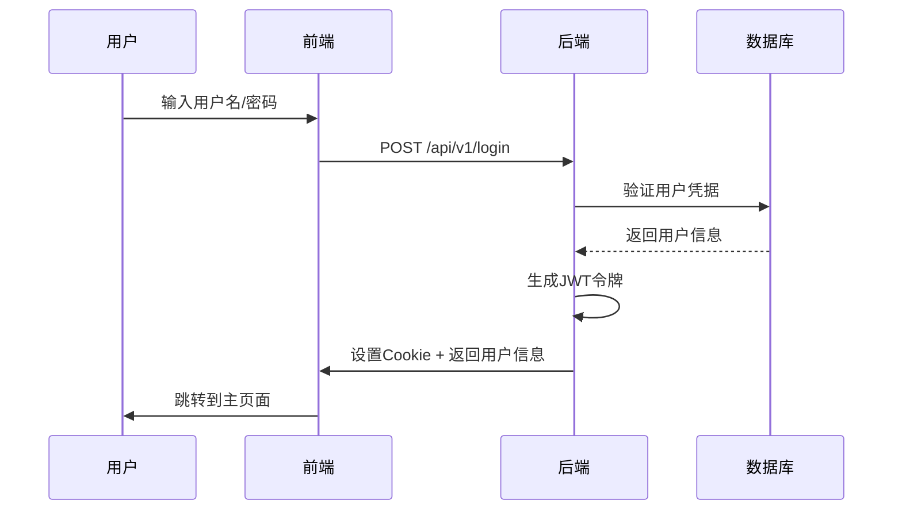
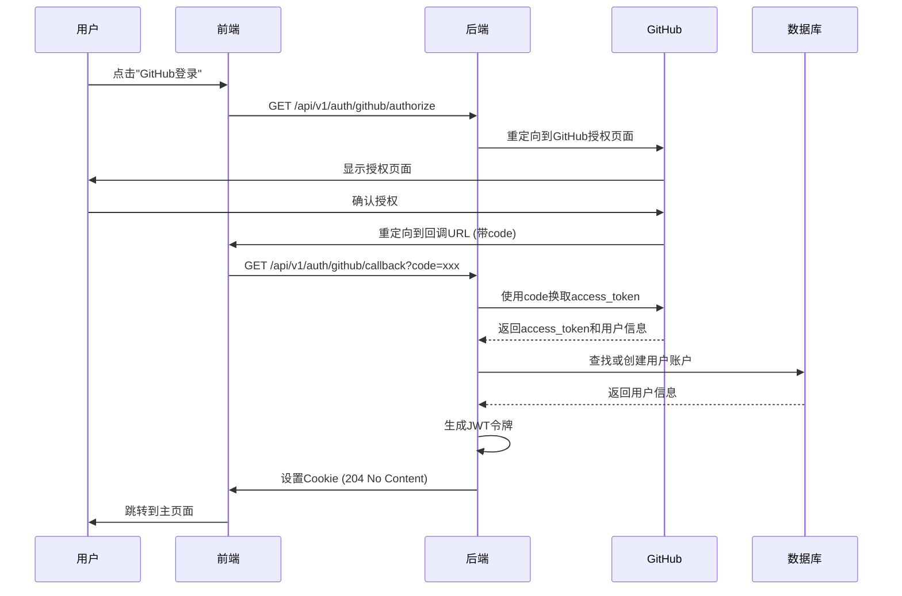

# ApeRAG 认证系统详细文档

## 概述

ApeRAG 采用基于 Cookie 的认证系统，支持多种认证方式：本地用户名/密码认证、Google OAuth2、GitHub OAuth2 等。系统基于 FastAPI-Users 库构建，提供了完整的用户管理和认证功能。

## 整体架构

ApeRAG 认证系统采用现代 Web 应用的标准架构，前后端分离，通过 RESTful API 进行通信：

- **前端**: React/TypeScript 应用，处理用户界面和认证流程
- **后端**: FastAPI 应用，提供认证 API 和业务逻辑
- **数据库**: PostgreSQL，存储用户信息和认证数据
- **第三方服务**: GitHub/Google OAuth 提供商

### 核心组件关系图



## 认证方式

ApeRAG 支持三种主要的认证方式：

1. **本地认证**: 传统的用户名/密码登录
2. **API Key 认证**: 用于程序化访问的令牌认证
3. **OAuth 社交登录**: 支持 GitHub 和 Google 第三方登录

## FastAPI-Users 核心实现

### 1. 核心配置

ApeRAG 使用 FastAPI-Users 库作为认证系统的基础，该库提供了完整的用户管理功能。

#### JWT 策略配置 (`aperag/views/auth.py`)

```python
COOKIE_MAX_AGE = 86400  # 24小时

def get_jwt_strategy() -> JWTStrategy:
    return JWTStrategy(secret=settings.jwt_secret, lifetime_seconds=COOKIE_MAX_AGE)

# Cookie传输配置
cookie_transport = CookieTransport(cookie_name="session", cookie_max_age=COOKIE_MAX_AGE)

# 认证后端
auth_backend = AuthenticationBackend(
    name="cookie",
    transport=cookie_transport,
    get_strategy=get_jwt_strategy,
)
```

#### 用户管理器

```python
class UserManager(BaseUserManager[User, uuid.UUID]):
    reset_password_token_secret = settings.jwt_secret
    verification_token_secret = settings.jwt_secret

    async def on_after_register(self, user: User, request: Optional[Request] = None):
        logger.info(f"User {user.id} has registered.")

    async def on_after_login(self, user: User, request: Optional[Request] = None):
        logger.info(f"User {user.id} logged in.")
```

### 2. 数据模型

#### 用户表结构 (`aperag/db/models.py`)

```python
class User(SQLAlchemyBaseUserTableUUID, Base):
    __tablename__ = "users"

    username: Mapped[str] = mapped_column(String(255), unique=True, index=True)
    email: Mapped[str] = mapped_column(String(255), unique=True, index=True)
    hashed_password: Mapped[str] = mapped_column(String(1024))
    role: Mapped[Role] = mapped_column(Enum(Role), default=Role.user)
    is_active: Mapped[bool] = mapped_column(Boolean, default=True)
    date_joined: Mapped[datetime] = mapped_column(DateTime, default=utc_now)
```

#### OAuth 账户表

```python
class OAuthAccount(SQLAlchemyBaseOAuthAccountTableUUID, Base):
    __tablename__ = "oauth_accounts"

    user_id: Mapped[uuid.UUID] = mapped_column(ForeignKey("users.id"))
    oauth_name: Mapped[str] = mapped_column(String(100))
    access_token: Mapped[str] = mapped_column(String(1024))
    account_id: Mapped[str] = mapped_column(String(320))
    account_email: Mapped[str] = mapped_column(String(320))
```

## 认证流程详解

### 1. 本地认证流程



#### 登录接口实现

```python
@router.post("/login", tags=["auth"])
async def login_view(
    request: Request,
    response: Response,
    data: view_models.Login,
    session: AsyncSessionDep,
    user_manager: UserManager = Depends(get_user_manager),
) -> view_models.User:
    # 验证用户凭据
    result = await session.execute(select(User).where(User.username == data.username))
    user = result.scalars().first()
    if not user:
        raise HTTPException(status_code=400, detail="Invalid credentials")

    # 验证密码
    verified, updated_password_hash = user_manager.password_helper.verify_and_update(
        data.password, user.hashed_password
    )
    if not verified:
        raise HTTPException(status_code=400, detail="Invalid credentials")

    # 生成JWT令牌并设置Cookie
    strategy = get_jwt_strategy()
    token = await strategy.write_token(user)
    response.set_cookie(
        key="session",
        value=token,
        max_age=COOKIE_MAX_AGE,
        httponly=True,
        samesite="lax"
    )

    return view_models.User(
        id=str(user.id),
        username=user.username,
        email=user.email,
        role=user.role,
        is_active=user.is_active,
        date_joined=user.date_joined.isoformat(),
    )
```

### 2. OAuth 认证流程



#### OAuth 配置实现

```python
# GitHub OAuth 配置
if settings.github_oauth_client_id and settings.github_oauth_client_secret:
    github_oauth_client = GitHubOAuth2(
        settings.github_oauth_client_id,
        settings.github_oauth_client_secret
    )
    github_oauth_router = fastapi_users.get_oauth_router(
        github_oauth_client,
        auth_backend,
        settings.jwt_secret,
        associate_by_email=True,
        is_verified_by_default=True,
        redirect_url=settings.oauth_redirect_url,  # 配置化的回调URL
    )
    router.include_router(github_oauth_router, prefix="/auth/github", tags=["auth"])
```

#### FastAPI-Users OAuth 路由功能

FastAPI-Users 自动生成以下 OAuth 相关的路由：

1. **授权端点**: `/api/v1/auth/github/authorize`
   - 生成 GitHub 授权 URL
   - 包含 state 参数防止 CSRF 攻击
   - 重定向用户到 GitHub 授权页面

2. **回调端点**: `/api/v1/auth/github/callback`
   - 处理 GitHub 回调请求
   - 使用 authorization code 换取 access token
   - 获取用户信息并创建/登录用户
   - 设置认证 Cookie
   - 返回 204 No Content 状态

### 3. API Key 认证

API Key 认证用于程序化访问，不依赖浏览器 Cookie。

#### API Key 模型

```python
class ApiKey(Base):
    __tablename__ = "api_keys"

    id: Mapped[uuid.UUID] = mapped_column(UUID, primary_key=True, default=uuid.uuid4)
    user_id: Mapped[uuid.UUID] = mapped_column(ForeignKey("users.id"))
    name: Mapped[str] = mapped_column(String(255))
    key_hash: Mapped[str] = mapped_column(String(255), unique=True, index=True)
    status: Mapped[ApiKeyStatus] = mapped_column(Enum(ApiKeyStatus), default=ApiKeyStatus.active)
    created_at: Mapped[datetime] = mapped_column(DateTime, default=utc_now)
    last_used_at: Mapped[Optional[datetime]] = mapped_column(DateTime, nullable=True)
```

#### API Key 认证实现

```python
async def get_current_user_from_api_key(
    authorization: str = Header(None),
    session: AsyncSessionDep = Depends(),
) -> Optional[User]:
    if not authorization or not authorization.startswith("Bearer "):
        return None

    api_key = authorization.split(" ")[1]
    key_hash = hashlib.sha256(api_key.encode()).hexdigest()

    result = await session.execute(
        select(ApiKey).where(
            ApiKey.key_hash == key_hash,
            ApiKey.status == ApiKeyStatus.active
        )
    )
    api_key_obj = result.scalars().first()

    if not api_key_obj:
        return None

    # 更新最后使用时间
    api_key_obj.last_used_at = utc_now()
    await session.commit()

    # 返回关联的用户
    user_result = await session.execute(
        select(User).where(User.id == api_key_obj.user_id)
    )
    return user_result.scalars().first()
```

## 前端实现详解

### 1. 登录页面 (`frontend/src/pages/accounts/signin.tsx`)

登录页面是认证系统的入口，支持多种登录方式：

#### 核心功能
- 显示可用的登录方式（本地/OAuth）
- 处理本地登录表单提交
- 处理 OAuth 登录按钮点击
- 管理登录状态和错误处理

#### GitHub OAuth 登录实现

```typescript
{loginMethods.includes('github') && (
  <Button
    icon={<i className="ri-github-fill" />}
    block
    onClick={async () => {
      try {
        const response = await fetch(
          `/api/v1/auth/github/authorize?redirect_uri=${encodeURIComponent(
            redirectUri || window.location.origin,
          )}`,
        );
        const data = await response.json();
        if (data.authorization_url) {
          window.location.href = data.authorization_url;
        }
      } catch (error) {
        console.error('GitHub OAuth error:', error);
      }
    }}
  >
    <FormattedMessage id="user.signin_with_github" />
  </Button>
)}
```

#### 本地登录实现

```typescript
const onFinish = useCallback(async () => {
  const values = await form.validateFields();
  setLoading(true);

  api
    .loginPost({ login: values })
    .then(() => {
      setLoading(false);
      toast.success(formatMessage({ id: 'user.signin_success' }));
      window.location.href = redirectUri || '/';
    })
    .catch(() => {
      setLoading(false);
    });
}, [redirectUri]);
```

### 2. OAuth 回调页面 (`frontend/src/pages/oauth-callback.tsx`)

OAuth 回调页面处理第三方认证服务的回调，完成认证流程：

#### 核心功能
- 解析 URL 参数（code、state 等）
- 调用后端 OAuth 回调接口
- 处理认证结果并跳转到主页面
- 错误处理和用户反馈

#### 实现细节

```typescript
const OAuthCallback = () => {
  const navigate = useNavigate();
  const [searchParams] = useSearchParams();

  useEffect(() => {
    const handleOAuth = async () => {
      try {
        // 获取URL查询参数
        const query = window.location.search;

        // 根据state参数确定OAuth提供商
        let provider = 'github'; // 默认GitHub
        const state = searchParams.get('state');
        if (state && state.includes('google')) {
          provider = 'google';
        }

        // 调用后端OAuth回调接口
        const callbackUrl = `/api/v1/auth/${provider}/callback${query}`;
        const response = await fetch(callbackUrl, {
          method: 'GET',
          headers: {
            'Content-Type': 'application/json',
          },
          credentials: 'include', // 重要：包含Cookie
        });

        if (!response.ok) {
          throw new Error(`HTTP error! status: ${response.status}`);
        }

        // FastAPI-Users OAuth回调返回204表示成功
        if (response.status === 204) {
          navigate('/'); // 认证成功，跳转到主页
        } else {
          // 处理其他状态码的响应
          try {
            const data = await response.json();
            if (data.access_token) {
              localStorage.setItem('authToken', data.access_token);
              localStorage.setItem('tokenType', data.token_type || 'bearer');
            }
            navigate('/');
          } catch (jsonError) {
            navigate('/'); // JSON解析失败也跳转到主页
          }
        }
      } catch (error) {
        console.error('Error handling OAuth callback:', error);
        navigate('/accounts/signin'); // 错误时跳转到登录页
      }
    };

    handleOAuth();
  }, [navigate, searchParams]);

  return (
    <PageContainer>
      <Spin size="large" />
      <div>Processing OAuth login...</div>
    </PageContainer>
  );
};
```

## API 接口详解

### 认证相关接口

#### 1. 获取登录方法
```http
GET /api/v1/auth/methods
```

**响应示例**:
```json
{
  "methods": ["local", "github", "google"]
}
```

#### 2. 本地登录
```http
POST /api/v1/login
Content-Type: application/json

{
  "username": "user@example.com",
  "password": "password123"
}
```

**响应示例**:
```json
{
  "id": "123e4567-e89b-12d3-a456-426614174000",
  "username": "testuser",
  "email": "user@example.com",
  "role": "user",
  "is_active": true,
  "date_joined": "2024-01-01T00:00:00Z"
}
```

#### 3. 用户注册
```http
POST /api/v1/register
Content-Type: application/json

{
  "username": "newuser",
  "email": "user@example.com",
  "password": "password123",
  "token": "invitation_token" // 可选，取决于注册模式
}
```

#### 4. 获取当前用户信息
```http
GET /api/v1/user
Cookie: session=jwt_token
```

#### 5. 登出
```http
POST /api/v1/logout
```

**响应**: 清除session cookie，返回 `{"success": true}`

### OAuth 接口

#### 1. GitHub OAuth 授权
```http
GET /api/v1/auth/github/authorize?redirect_uri=http://example.com/callback
```

**响应示例**:
```json
{
  "authorization_url": "https://github.com/login/oauth/authorize?client_id=xxx&redirect_uri=xxx&state=xxx"
}
```

#### 2. GitHub OAuth 回调
```http
GET /api/v1/auth/github/callback?code=xxx&state=yyy
```

**响应**: 204 No Content + 设置认证Cookie

#### 3. Google OAuth (类似GitHub)
```http
GET /api/v1/auth/google/authorize?redirect_uri=http://example.com/callback
GET /api/v1/auth/google/callback?code=xxx&state=yyy
```

## 配置说明

### 环境变量配置

```bash
# JWT密钥 - 用于签名认证令牌
JWT_SECRET=your-super-secret-key-here

# OAuth回调URL - 前端OAuth回调页面地址
OAUTH_REDIRECT_URL=http://127.0.0.1:3000/web/oauth-callback

# GitHub OAuth配置
GITHUB_OAUTH_CLIENT_ID=your-github-client-id
GITHUB_OAUTH_CLIENT_SECRET=your-github-client-secret

# Google OAuth配置
GOOGLE_OAUTH_CLIENT_ID=your-google-client-id
GOOGLE_OAUTH_CLIENT_SECRET=your-google-client-secret

# 注册模式
REGISTER_MODE=open  # open: 开放注册, invitation: 邀请制注册
```

### 第三方OAuth应用配置

#### GitHub OAuth 应用配置

1. **创建GitHub OAuth应用**:
   - 访问 [GitHub Developer Settings](https://github.com/settings/developers)
   - 点击 "New OAuth App"
   - 填写应用信息：
     - **Application name**: ApeRAG
     - **Homepage URL**: `http://127.0.0.1:3000` (或你的域名)
     - **Application description**: ApeRAG Knowledge Base System
     - **Authorization callback URL**: `http://127.0.0.1:3000/web/oauth-callback`

2. **获取凭据**:
   - 创建后获取 `Client ID` 和 `Client Secret`
   - 将这些值配置到环境变量中

3. **权限范围**:
   - GitHub OAuth默认请求 `user:email` 权限
   - 用于获取用户基本信息和邮箱地址

#### Google OAuth 应用配置

1. **创建Google Cloud项目**:
   - 访问 [Google Cloud Console](https://console.cloud.google.com/)
   - 创建新项目或选择现有项目

2. **启用Google+ API**:
   - 在API库中搜索并启用 "Google+ API"
   - 这是获取用户信息所必需的

3. **创建OAuth 2.0客户端ID**:
   - 转到 "凭据" 页面
   - 点击 "创建凭据" > "OAuth 2.0客户端ID"
   - 选择应用类型为 "Web应用"
   - 设置授权重定向URI：`http://127.0.0.1:3000/web/oauth-callback`

4. **获取凭据**:
   - 下载JSON凭据文件或直接复制客户端ID和密钥
   - 配置到环境变量中

## 安全特性

### 1. JWT令牌安全

- **强密钥签名**: 使用配置的JWT_SECRET对令牌进行HMAC签名
- **有限生命周期**: 令牌默认24小时过期，减少被盗用的风险
- **HttpOnly Cookie**: 令牌仅通过HttpOnly Cookie传输，防止XSS攻击
- **安全传输**: Cookie设置SameSite=Lax，防止CSRF攻击

```python
# JWT令牌配置
COOKIE_MAX_AGE = 86400  # 24小时
cookie_transport = CookieTransport(
    cookie_name="session",
    cookie_max_age=COOKIE_MAX_AGE,
    cookie_httponly=True,
    cookie_samesite="lax"
)
```

### 2. 密码安全

- **bcrypt加密**: 使用bcrypt算法对密码进行哈希存储
- **盐值随机**: 每个密码使用不同的随机盐值
- **密码验证**: 支持密码强度验证（可扩展）
- **密码更新**: 支持安全的密码修改流程

```python
# FastAPI-Users自动处理密码加密
user_manager.password_helper.hash(password)  # 加密
user_manager.password_helper.verify_and_update(password, hash)  # 验证
```

### 3. OAuth安全

- **State参数**: 使用state参数防止CSRF攻击
- **授权码模式**: 使用标准的OAuth 2.0授权码流程
- **HTTPS强制**: 生产环境强制使用HTTPS传输
- **令牌安全存储**: OAuth令牌安全存储在数据库中

```python
# OAuth客户端配置示例
github_oauth_client = GitHubOAuth2(
    client_id=settings.github_oauth_client_id,
    client_secret=settings.github_oauth_client_secret
)
```

### 4. API Key安全

- **哈希存储**: API Key在数据库中以SHA-256哈希形式存储
- **使用跟踪**: 记录API Key的最后使用时间
- **状态管理**: 支持激活/禁用API Key
- **用户关联**: 每个API Key关联到特定用户账户

```python
# API Key哈希存储
key_hash = hashlib.sha256(api_key.encode()).hexdigest()
```

### 5. 会话安全

- **自动过期**: 会话令牌自动过期，需要重新登录
- **安全登出**: 登出时清除所有认证信息
- **并发会话**: 支持多设备同时登录
- **会话验证**: 每次请求验证会话有效性

## 扩展和自定义

### 1. 添加新的OAuth提供商

要添加新的OAuth提供商（如Microsoft、Twitter等），需要：

1. **安装OAuth客户端库**:
```bash
pip install httpx-oauth[microsoft]  # 示例：Microsoft
```

2. **添加配置**:
```python
# 在aperag/config.py中添加
microsoft_oauth_client_id: str = Field("", alias="MICROSOFT_OAUTH_CLIENT_ID")
microsoft_oauth_client_secret: str = Field("", alias="MICROSOFT_OAUTH_CLIENT_SECRET")
```

3. **配置OAuth路由**:
```python
# 在aperag/views/auth.py中添加
if settings.microsoft_oauth_client_id and settings.microsoft_oauth_client_secret:
    microsoft_oauth_client = MicrosoftOAuth2(
        settings.microsoft_oauth_client_id,
        settings.microsoft_oauth_client_secret
    )
    microsoft_oauth_router = fastapi_users.get_oauth_router(
        microsoft_oauth_client,
        auth_backend,
        settings.jwt_secret,
        associate_by_email=True,
        is_verified_by_default=True,
        redirect_url=settings.oauth_redirect_url,
    )
    router.include_router(microsoft_oauth_router, prefix="/auth/microsoft", tags=["auth"])
```

4. **更新前端**:
```typescript
// 在登录页面添加Microsoft登录按钮
{loginMethods.includes('microsoft') && (
  <Button onClick={() => handleOAuthLogin('microsoft')}>
    Sign in with Microsoft
  </Button>
)}
```

### 2. 自定义用户字段

要添加自定义用户字段：

1. **修改用户模型**:
```python
# 在aperag/db/models.py中修改User类
class User(SQLAlchemyBaseUserTableUUID, Base):
    # 现有字段...
    full_name: Mapped[Optional[str]] = mapped_column(String(255), nullable=True)
    avatar_url: Mapped[Optional[str]] = mapped_column(String(500), nullable=True)
    department: Mapped[Optional[str]] = mapped_column(String(100), nullable=True)
```

2. **创建数据库迁移**:
```bash
alembic revision --autogenerate -m "Add custom user fields"
alembic upgrade head
```

3. **更新API响应模型**:
```python
# 在aperag/schema/view_models.py中更新
class User(BaseModel):
    # 现有字段...
    full_name: Optional[str] = None
    avatar_url: Optional[str] = None
    department: Optional[str] = None
```

### 3. 实现自定义认证逻辑

可以通过继承FastAPI-Users的组件来实现自定义逻辑：

```python
# 自定义用户管理器
class CustomUserManager(UserManager):
    async def on_after_register(self, user: User, request: Optional[Request] = None):
        # 自定义注册后逻辑
        logger.info(f"New user registered: {user.email}")
        # 发送欢迎邮件、创建默认数据等

    async def on_after_login(self, user: User, request: Optional[Request] = None):
        # 自定义登录后逻辑
        logger.info(f"User logged in: {user.email}")
        # 记录登录日志、更新最后登录时间等

# 自定义认证策略
class CustomJWTStrategy(JWTStrategy):
    async def write_token(self, user: User) -> str:
        # 自定义令牌生成逻辑
        data = {"sub": str(user.id), "aud": "aperag-users"}
        # 添加自定义声明
        data.update({"role": user.role.value, "username": user.username})
        return jwt.encode(data, self.secret, algorithm="HS256")
```

## 故障排除

### 常见问题及解决方案

#### 1. OAuth回调失败

**症状**: 用户完成OAuth授权后，回调页面显示错误或无法登录

**可能原因**:
- OAuth应用配置的回调URL不匹配
- 环境变量配置错误
- 网络连接问题

**解决方案**:
```bash
# 检查环境变量配置
echo $GITHUB_OAUTH_CLIENT_ID
echo $OAUTH_REDIRECT_URL

# 检查后端日志
tail -f logs/aperag.log | grep oauth

# 验证回调URL配置
curl -I http://127.0.0.1:3000/web/oauth-callback
```

#### 2. Cookie认证失败

**症状**: 用户登录后刷新页面显示未认证状态

**可能原因**:
- JWT密钥配置错误
- Cookie域名或路径设置问题
- 时间同步问题

**解决方案**:
```python
# 检查JWT配置
print(f"JWT Secret: {settings.jwt_secret}")
print(f"Cookie Max Age: {COOKIE_MAX_AGE}")

# 验证Cookie设置
# 在浏览器开发者工具中检查Cookie是否正确设置
```

#### 3. 用户注册失败

**症状**: 用户无法完成注册流程

**可能原因**:
- 注册模式配置问题
- 邀请令牌无效或过期
- 用户名/邮箱重复

**解决方案**:
```python
# 检查注册模式
print(f"Register Mode: {settings.register_mode}")

# 检查数据库约束
# 确保用户名和邮箱字段的唯一性约束正确设置
```

#### 4. API Key认证失败

**症状**: 使用API Key访问接口返回401错误

**可能原因**:
- API Key格式错误
- API Key已过期或被禁用
- Authorization头格式不正确

**解决方案**:
```bash
# 正确的API Key使用方式
curl -H "Authorization: Bearer your-api-key" \
     http://127.0.0.1:8000/api/v1/user

# 检查API Key状态
# 在数据库中查询api_keys表确认状态
```

### 调试技巧

#### 1. 启用详细日志

```python
# 在aperag/config.py中设置
import logging
logging.basicConfig(level=logging.DEBUG)

# 或在环境变量中设置
export LOG_LEVEL=DEBUG
```

#### 2. 使用浏览器开发者工具

- **Network标签**: 检查认证相关的HTTP请求和响应
- **Application标签**: 查看Cookie设置和存储
- **Console标签**: 查看JavaScript错误和日志

#### 3. 验证JWT令牌

```python
import jwt
from aperag.config import settings

# 解码JWT令牌查看内容
token = "your-jwt-token"
decoded = jwt.decode(token, settings.jwt_secret, algorithms=["HS256"])
print(decoded)
```

#### 4. 数据库查询调试

```sql
-- 查看用户表
SELECT id, username, email, role, is_active FROM users;

-- 查看OAuth账户关联
SELECT u.username, o.oauth_name, o.account_email
FROM users u
JOIN oauth_accounts o ON u.id = o.user_id;

-- 查看API Key状态
SELECT u.username, a.name, a.status, a.created_at, a.last_used_at
FROM users u
JOIN api_keys a ON u.id = a.user_id;
```

## 性能优化

### 1. 数据库优化

- **索引优化**: 确保用户名、邮箱、API Key哈希等字段有适当的索引
- **连接池**: 配置合适的数据库连接池大小
- **查询优化**: 使用适当的查询策略，避免N+1问题

### 2. 缓存策略

```python
# 可以考虑添加用户信息缓存
from functools import lru_cache

@lru_cache(maxsize=1000)
async def get_user_by_id(user_id: str) -> Optional[User]:
    # 缓存用户信息，减少数据库查询
    pass
```

### 3. 会话管理

- **令牌刷新**: 实现令牌自动刷新机制
- **会话清理**: 定期清理过期的会话数据
- **负载均衡**: 在多实例部署时考虑会话共享

## 总结

ApeRAG的认证系统基于现代Web安全最佳实践，具有以下特点：

### 核心优势

1. **安全性**:
   - 基于JWT的无状态认证
   - HttpOnly Cookie防止XSS攻击
   - bcrypt密码加密
   - OAuth 2.0标准流程

2. **灵活性**:
   - 支持多种认证方式
   - 可配置的注册模式
   - 易于扩展的OAuth提供商

3. **易用性**:
   - 统一的认证接口
   - 清晰的前后端分离
   - 详细的错误处理

4. **可维护性**:
   - 基于FastAPI-Users成熟库
   - 清晰的代码结构
   - 完善的配置管理

### 技术栈

- **后端**: FastAPI + FastAPI-Users + SQLAlchemy + PostgreSQL
- **前端**: React + TypeScript + Ant Design
- **认证**: JWT + Cookie + OAuth 2.0
- **安全**: bcrypt + HTTPS + CSRF保护

### 适用场景

ApeRAG的认证系统适用于：
- 企业内部知识库系统
- 需要多种登录方式的Web应用
- 要求高安全性的数据管理平台
- 支持API访问的服务系统

通过合理的配置和使用，ApeRAG认证系统能够为用户提供安全、便捷的访问体验，同时为开发者提供灵活的扩展能力。
